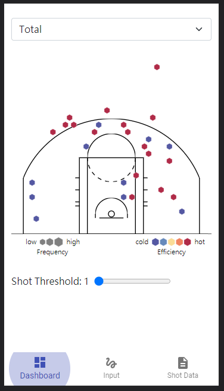
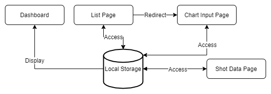
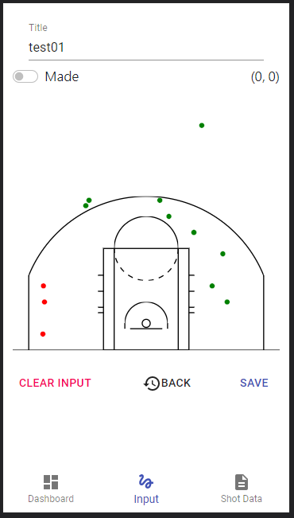

# BasketballShotChart
## Table of Content
1. [Project Information](#appinfo)
2. [Technologies](#technologies)
3. [Design](#design)
4. [Features](#features)

## Project Information
Demo: https://basketball-shotchart.netlify.app/  
It lets people input their shot data and generate their own shot chart and store it on the local storage. 
 

## Technologies
- React Hook
- D3

## Design

## Features

### Dashboard 
- The shot threshold can be adjusted to fullfilled the need.
- Can download their own shot data which stores in local storage.
- Can remove all data in local storage. 
 

### Input Page
- Can input made and miss shot by clicking on the chart.
- Knowing the spot position by pointing on it.
- Can load local storage data.
- Can undo by clicking BACK button. 

 

### Data Page
- Can edit local storage data and save it. 
 
